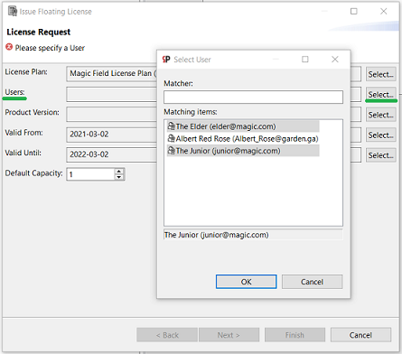
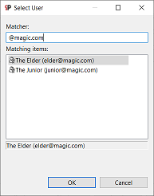
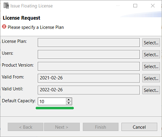
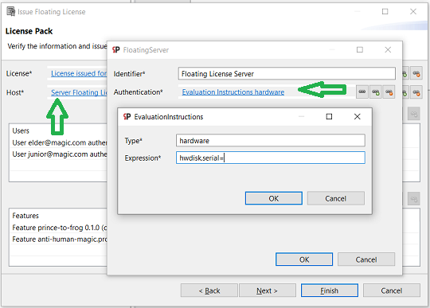
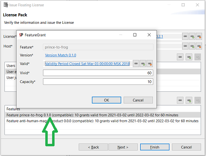

<!--
tags: licensing, floating, operator
stories: floating-licensing:10
actors: lic-operator
-->
Issue a floating license pack
===

Information to gather
---
Prior issuing a floating license for a client, the following information must be collected from client:
- set of _users_ who will exploit the product under this license
- _Floating Server_ credentials:
   - authentication: any unique property that will allow us to identify the server hosting machine. Pretty much we do for a user: define _condition type_ (only `hardware` is supported) and a _condition expression_ (like `baseboard.serialnumber=AAT1U000001250APJ0182`)
   - _ip_ address and _port_, available for all users from the set above  

Issuing
---
**1.** Run _Issue Floating License_ wizard. It's available on left control panel.

##### Form licensing request
**2.** The licensing request page is pretty similar to the [issue personal license](issue-personal-license-pack.md) wizard.

**3.** Floating license pack can grant access to the product for several users. Choose all users that will have that access: 
 - person by person, using regular Ctrl+Click and Shift+Click for multiselection 
 
  
 - or filtering by a mask 
 
 
 
**4.** Floating license pack can allow several users exploit the same feature at the same time. 
Defining a grant for a feature, you can specify it's _capacity_ - amount of users that can have simultaneous access to this feature. 

As you can have lots of features protected by licensing in your product, you can specify _default capacity_ of a feature grant, that can be edited further for particular feature grant.

 
 
 ##### Define license pack
 **5.** Floating License Server credentials you've got from your customer should fill _Host_ definition on the Licensing Pack page:
 
 
 
 **6.** For each feature configured for chosen product version you find generated [_feature grant_](floating-license-pack.md) with 
  - its own validity period inherited from the pack,
  - default capacity specified in the licensing request,
  - one-hour-vivid,
  - with validity period inherited from the pack. 
  
 You can redefine functional parameters for each grant; use double-click on a feature grants table row.
 
  
 
##### Configure personal floating access files generation
Last page helps if a user from the pack does not have a floating access file for the Floating License Server defined in the pack. 
If so, check _Generate_ and fill server connection data retrieved from the client.

##### Issue license pack
After _Finish_ is pressed, floating license pack is [generated and persisted](floating-license-pack.md) into the folder named after the pack's identifier, and the path to it is shown. 
